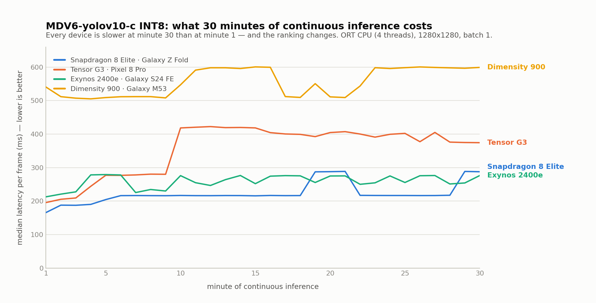

# Results

Raw measurements behind [microsoft/MegaDetector#34](https://github.com/microsoft/MegaDetector/issues/34).
Everything here is regenerated by the scripts in the repo root, except the
device CSVs — those need the phones.

## Sustained load: what 30 minutes of continuous inference costs

A single warm median says what a phone does for two seconds on a bench. A field
unit runs for hours in a sealed enclosure with no airflow, so each device ran
**30 minutes of back-to-back inference**, logging per-minute median/p90, thermal
status and battery temperature.

<picture>
  <source media="(prefers-color-scheme: dark)" srcset="sustained_curves_dark.png">
  
</picture>

*MDV6-yolov10-c INT8 QDQ (3.3 MB) · 1280×1280 · batch 1 · ORT CPU 4 threads ·
onnxruntime-android 1.20.0, arm64 · each device started cold and idle.*

| SoC (device) | minute 1 | steady state¹ | degradation | frames in 30 min | worst thermal |
|---|--:|--:|--:|--:|:--|
| Snapdragon 8 Elite (Galaxy Z Fold8 Ultra) | **166 ms** | **217 ms** | +74% | **8 087** | CRITICAL |
| Tensor G3 (Pixel 8 Pro) | 196 ms | 399 ms | **+91%** | 5 185 | LIGHT |
| Exynos 2400e (Galaxy S24 FE) | 213 ms | 275 ms | +30% | 6 975 | MODERATE |
| Dimensity 900 (Galaxy M53) | 540 ms | 598 ms | **+11%** | 3 234 | **NONE** |

¹ median of the last 10 minutes.

**The bench ranking inverts.** At minute 1 the Pixel 8 Pro is 9% *faster* than
the Galaxy S24 FE (196 vs 213 ms). Over 30 minutes it is 45% *slower* (399 vs
275 ms) and delivers 26% fewer frames. Pick hardware by a single latency
measurement and you pick the wrong phone.

**The faster the chip, the more it loses.** The Dimensity 900 never throttled
once — `NONE` for the full 30 minutes — because it never gets hot enough for the
governor to intervene. Its disadvantage against the Tensor G3 shrinks from ×2.8
at minute 1 to ×1.5 in steady state.

**`getCurrentThermalStatus()` is not comparable across vendors.** The
relationship between reported severity and measured loss is inverted: Tensor G3
reports `LIGHT` while losing 91%; Snapdragon reports `CRITICAL` while losing
74%; Dimensity reports `NONE` throughout while its own throughput varies by 17%.
Deployment logic keyed on those levels fires early on Qualcomm and never fires
on Tensor, where it is actually needed.

**p90 leads the median by ~10 minutes.** On the Pixel, p90 climbs from ~290 to
~490 ms at minute 8 while the median is still flat; the median only follows at
minute 26. Monitoring the median alone means learning about throttling late.

**Starting temperature buys time.** Two Pixel runs, same binary: from 26.5 °C it
reached ~420 ms at minute 5; from 19.0 °C, only at minute 30. 7.5 °C of headroom
bought 25 minutes of full-speed operation — an outdoor deployment variable, not
a lab detail.

### What these runs do not measure

- **Energy.** All four devices were mains-powered. The charge counter is not a
  usable substitute: on two of the four it is exactly `battery_percent ×
  constant` rather than a coulomb count, and where it looks real the implied
  capacity is about half the rated one. A trustworthy mAh-per-1000-frames figure
  needs an unplugged device or an external power monitor.
- **The full pipeline.** Inference only, on a fixed input tensor — no JPEG
  decode or letterboxing.
- **Replication.** One run per device, except the Pixel (two).

`sustained_pixel8pro_tensorG3_30min_HOTSPOT-ON.csv` is kept deliberately: that
run shared a 5G hotspot, so its modem added heat unrelated to inference. Since
the Pixel carries the ranking claim it was re-measured with the hotspot off, and
the clean run is the one reported. The two bracket the same conclusion (+91% vs
+108% degradation, 399 vs 407 ms steady state), which is stronger than either
alone. Note the clean run ran *hotter* (38.9 vs 34.5 °C) because the battery was
fast-charging to full — neither run has a fully controlled thermal environment.

## Accuracy: 640 vs 1280

`eval_fp32_640_nacti.json` and `eval_fp32_1280_nacti.json` are the same FP32
model on the same 210-image class-balanced NACTI subset, with only `--imgsz`
changed. All three compact checkpoints record `train_args.imgsz: 640`, while
Pytorch-Wildlife infers at 1280 — [an open question on the
issue](https://github.com/microsoft/MegaDetector/issues/34).

| | 1280 (framework default) | 640 (as trained) |
|---|--:|--:|
| mAP@0.5 | 0.498 | **0.689** |
| mAP@0.5:0.95 | 0.333 | **0.544** |
| animal recall@0.2 | **0.813** | 0.714 |
| person recall@0.2 | 0.220 | **0.280** |
| vehicle recall@0.2 | 0.597 | **0.965** |
| animal FN-rate | **4.3%** | 5.7% |
| latency (desktop CPU) | 143.9 ms | **33.5 ms** |

Not a clean win either way: aggregate accuracy and cost strongly favour 640, but
**animal recall is better at 1280** — the metric that matters most for camera
traps. The likely mechanism is object scale: in this subset animals are small
(median 0.9% of frame) and vehicles large (median 41%), so upscaling to 2× the
training resolution moves small objects toward the scale the model learned and
pushes large ones past it.

## Data dictionary — `sustained_*.csv`

Header lines start with `#` and carry the run summary
(`minute1_median_ms`, `last_minute_median_ms`, `degradation_pct`,
`thermal_start` / `thermal_worst`, `started_hot`, `charging`, `mah_per_1000`).
Then one row per elapsed minute:

| column | meaning |
|---|---|
| `minute` | 1-based index of the elapsed minute |
| `frames` | inferences completed within that minute |
| `fps` | `frames / 60` |
| `median_ms`, `p90_ms` | per-frame latency within that minute |
| `thermal` | `PowerManager.getCurrentThermalStatus()` at the end of the minute — vendor-defined, not comparable across SoCs |
| `battery_pct` | battery level |
| `battery_temp_c` | battery temperature (a lagging proxy for SoC heat; the only skin-side reading available without root) |
| `charge_uah` | `BATTERY_PROPERTY_CHARGE_COUNTER` — **verify it is a real coulomb counter before deriving energy from it** (see above) |

## Files

| | |
|---|---|
| `sustained_*_30min.csv` | per-minute curves, one per SoC |
| `sustained_pixel8pro_tensorG3_30min_HOTSPOT-ON.csv` | contaminated Pixel run, kept as a replicate |
| `sustained_pixel8pro_tensorG3_run1_7min.csv` | interrupted warm-start run (26.5 °C) used for the starting-temperature comparison |
| `sustained_curves_{light,dark}.png` | rendered by `../plot_sustained.py` |
| `eval_fp32_{640,1280}_nacti.json` | accuracy at both resolutions, written by `../eval.py` |
